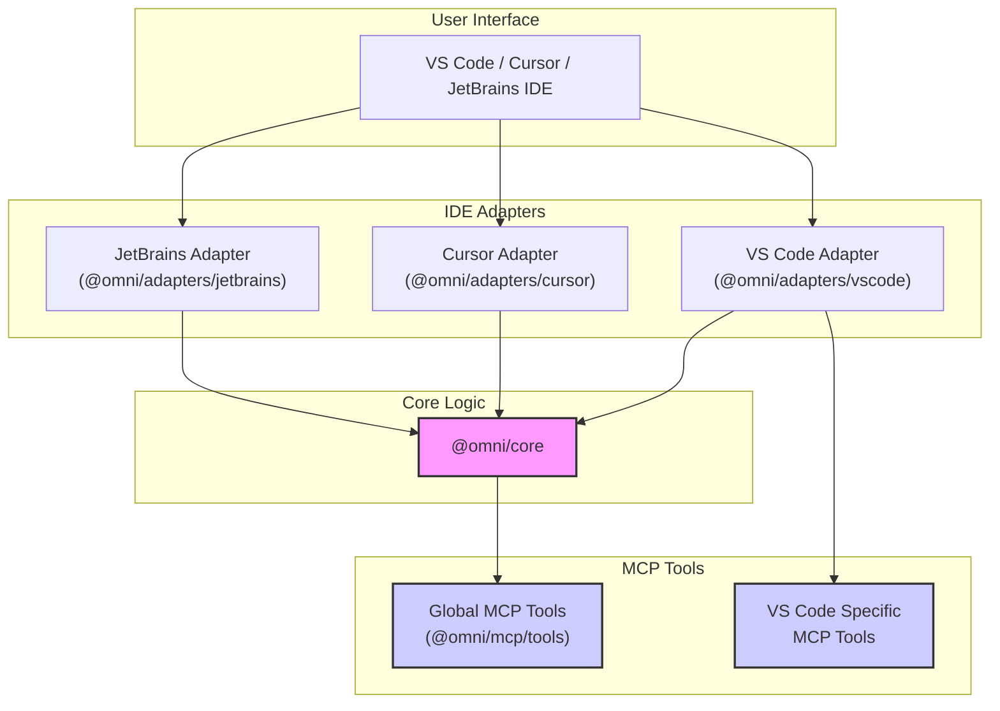
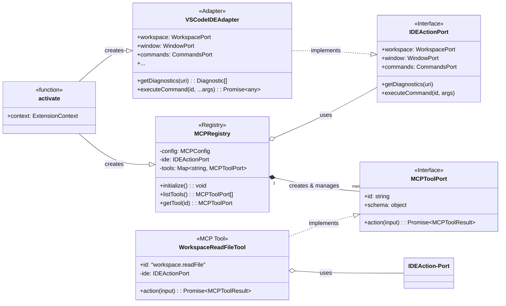
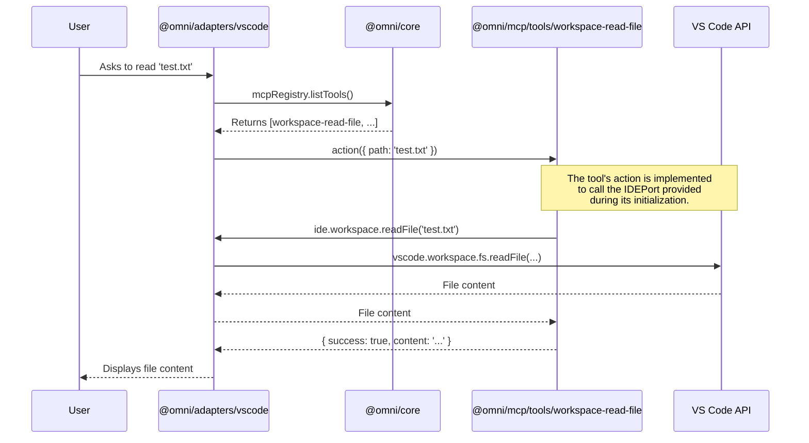

# Architecture

## Pattern: Hexagonal Architecture (Ports & Adapters)

Omni uses **Hexagonal Architecture** (also called Ports & Adapters or Clean Architecture). The core rule is:

> **Domain code never depends on IDE SDKs. IDE SDKs never leak into domain code.**

All dependencies point **inward** — toward `@omni/core`. The outer layers (adapters, teams) depend on the inner layer. The inner layer knows nothing about VS Code, JetBrains, or any external SDK.

### Why Hexagonal?

| Concern | Benefit |
|---------|---------|
| **Testability** | Domain and team logic can be unit-tested with mock ports — no IDE installed |
| **IDE portability** | Swap the VS Code adapter for a JetBrains sidecar without touching team code |
| **Boundary enforcement** | ESLint import rules prevent teams from importing adapters directly |
| **Replaceability** | Any adapter can be replaced or mocked without rewriting business logic |

---

## Architecture Diagrams

### High-Level Overview



### Detailed Hierarchical Architecture

This diagram provides a senior-level, hierarchical view of the entire platform, showing how components are nested and how they interact across layers.

```mermaid
graph TD
    subgraph "Omni Extension Platform"
        direction TB

        subgraph ide_hosts ["IDE Host Environments"]
            direction LR
            subgraph "VS Code / Cursor"
                direction TB
                A["Extension Entry Point<br>(activate.ts)"]
                B["VSCodeIDEAdapter<br>(implements IDEActionPort)"]
                A --> B
            end

            subgraph "JetBrains"
                direction TB
                C["Plugin Entry Point<br>(Kotlin/Java)"]
                D["Node.js Sidecar Process<br>(main.ts)"]
                E["JetBrainsSidecar Adapter<br>(implements IDEActionPort)"]
                C -.-> D
                D --> E
            end
        end

        subgraph core_infra ["Shared Core Infrastructure"]
            direction LR
            subgraph "@omni/core"
                F["<b>IDEActionPort</b><br>(Interface)"]
                G["<b>MCPToolPort</b><br>(Interface)"]
                H["Domain Logic, Types, RPC"]
            end
            
            B --> F
            E --> F

            subgraph "@omni/mcp"
                I["<b>MCPRegistry</b><br>(Manages all tools)"]
                J["ExternalMCPToolAdapter"]
            end
            
            I -- uses --> F
        end

        subgraph features_and_tools ["Features & Tools"]
            direction LR
            
            subgraph "Team-Specific Features (teams/*)"
                K["Team A Features"]
                L["Team B Features"]
                M["..."]
                K -- uses --> F
                L -- uses --> F
            end

            subgraph "MCP Tools (packages/mcp/tools)"
                N["Global Tools<br>(e.g., ExampleTool)"]
                O["IDE-Specific Tools<br>(e.g., workspace-read-file)"]
                P["External Tools<br>(via Adapter)"]
                
                I *-- "manages" N
                I *-- "manages" O
                I *-- "manages" P

                N -- uses --> F
                O -- uses --> F
            end
        end
    end

    style F fill:#B2EBF2,stroke:#00796B,stroke-width:2px
    style G fill:#B2EBF2,stroke:#00796B,stroke-width:2px
    style I fill:#FFCDD2,stroke:#D32F2F,stroke-width:2px
```

### Low-Level Class Diagram (VS Code Adapter)

This diagram details the key classes and interfaces within the VS Code adapter, showing how the `activate` function wires together the `VSCodeIDEAdapter`, `MCPRegistry`, and the individual MCP tools.



### MCP Tool Execution Sequence

This diagram illustrates how a user request to an MCP tool flows through the system, from the IDE to the core logic and back.



---

## Component Reference

### `@omni/core` — The Inner Ring

The pure contract layer. Contains **zero** IDE dependencies.

| Sub-path | Exports | Purpose |
|----------|---------|---------|
| `@omni/core` | `IDEActionPort`, `TelemetryPort` | Port interfaces every adapter must implement |
| `@omni/core/ports` | `MCPToolPort`, `MCPToolInput`, `MCPToolResult` | MCP tool contract |
| `@omni/core/domain` | `FeatureContext`, `executeFeatureAction` | Shared domain orchestration |
| `@omni/core/rpc` | `SidecarRequest`, `SidecarResponse`, `SidecarTransport` | JSON-RPC 2.0 types for sidecar comms |
| `@omni/core/errors` | `OmniError`, `PortNotImplementedError`, `SidecarConnectionError` | Typed errors |
| `@omni/core/types` | `EnvironmentId`, `TeamId`, `OmniResult<T>`, `ToolManifest` | Shared value types |
| `@omni/core/utils` | `assertNonNullable`, `isRecord`, `deepMerge` | Pure utility functions |

**Rule:** Nothing inside `@omni/core` may import from `@omni/adapters-*`, `vscode`, or any external SDK.

---

### `@omni/mcp` — MCP Tool Layer

The Model Context Protocol integration layer. All MCP tools are **project-global** — not owned by any single team.

| Sub-path | Exports | Purpose |
|----------|---------|---------|
| `@omni/mcp` | `MCPRegistry`, `ExternalMCPToolAdapter` | Core registry and external server adapter |
| `@omni/mcp/config` | `MCPConfig`, `MCPToolConfig`, `isToolEnabled` | Config schema and runtime flag checks |
| `@omni/mcp/tools` | `ExampleTool` | Built-in project-level tools |

**`MCPRegistry` lifecycle:**
```
activate()
  └─ new MCPRegistry(config)
       ├─ registry.register(new WorkspaceReadFileTool())
       ├─ registry.register(new GitStatusTool())
       └─ registry.register(new ExternalMCPToolAdapter({ toolId: 'github', ...transport }))

user/agent calls tool
  └─ registry.execute('vscode.workspace.readFile', { method: 'readFile', params: { uri } })
       ├─ isToolEnabled(config, toolId) → disabled? return error result
       └─ tool.execute(input) → MCPToolResult
```

**`ExternalMCPToolAdapter`** wraps an external MCP server (e.g. `@modelcontextprotocol/server-github`) via a `SidecarTransport` function. The external server lives outside this repo; the adapter registers it as if it were a built-in tool.

---

### Adapters

Each adapter implements `IDEActionPort` and wires up `MCPRegistry` at startup.

| Adapter | Package | Entry Point | Artifact |
|---------|---------|-------------|----------|
| VS Code | `@omni/adapters-vscode` | `activate.ts` → `vscode.ExtensionContext` | `.vsix` |
| Cursor | `@omni/adapters-cursor` | re-uses VS Code `activate` | `.vsix` |
| JetBrains | `@omni/adapters-jetbrains` | `activate.ts` → HTTP JSON-RPC server on `:7654` | `.zip` |

**JetBrains sidecar pattern:**  
Because JetBrains plugins cannot load Node.js directly, the extension ships a standalone Node.js process (the _sidecar_). The JetBrains plugin communicates with it over localhost HTTP using JSON-RPC 2.0.

```
JetBrains Plugin ──HTTP POST /rpc──▶ Node.js Sidecar (port 7654)
                                          └─ MCPRegistry.execute(...)
                ◀──JSON-RPC response──────
```

Health check: `GET http://127.0.0.1:7654/health`

---

### Teams

Each team is an isolated npm workspace package. Teams:
- Implement features by calling `IDEActionPort` methods (never importing adapter code)
- Own their API spec (`specs/openspec.json`, `specs/BMAD_doc.md`)
- Own their per-IDE extension manifests (`manifests/{vscode,cursor,jetbrains}.json`)
- Are validated independently in CI via `spec:validate`

---

### `controller/`

Central governance layer, not shipped to end users.

| Package | Purpose |
|---------|---------|
| `governance-api` | Ingests `MetricsEvent` objects from any environment via `TelemetryPort` |
| `dashboard` | Aggregates `DashboardData` for observability tooling |
| `schemas/metrics.json` | JSON Schema for telemetry event validation |

---

## Dependency Graph (simplified)

```
                    @omni/core
                   ↑    ↑    ↑
              team-*   @omni/mcp   controller
                              ↑
                    @omni/adapters-vscode
                    @omni/adapters-cursor
                    @omni/adapters-jetbrains
```

Arrows represent "depends on". No arrows point into `@omni/core` from adapters — only upward.

---

## Monorepo Build Engine: Turborepo

`turbo.json` defines the pipeline:

```json
build  → dependsOn: ["^build"]   (builds dependencies first)
test   → dependsOn: ["build"]
lint   → no deps (parallel)
spec:validate → no deps (parallel)
```

`npx turbo run build` builds the entire graph in the correct topological order, caching unchanged outputs.
